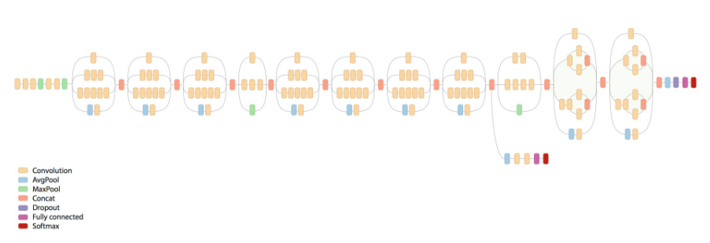
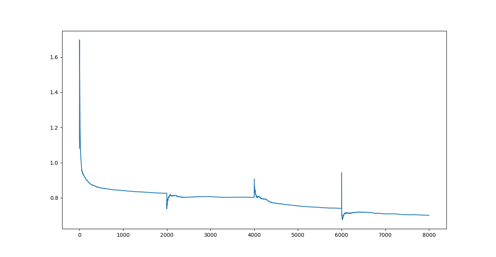
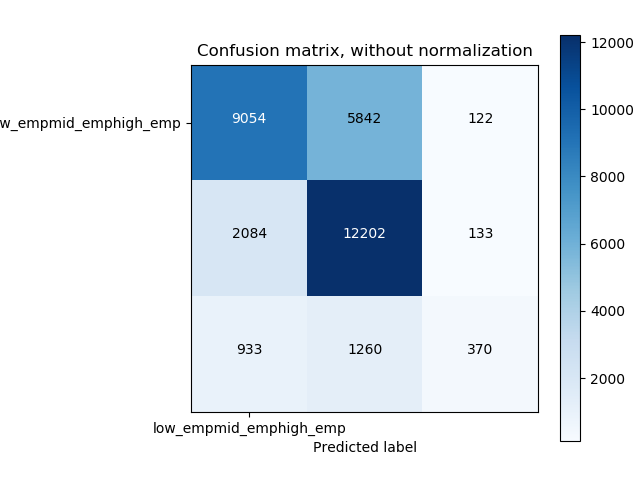
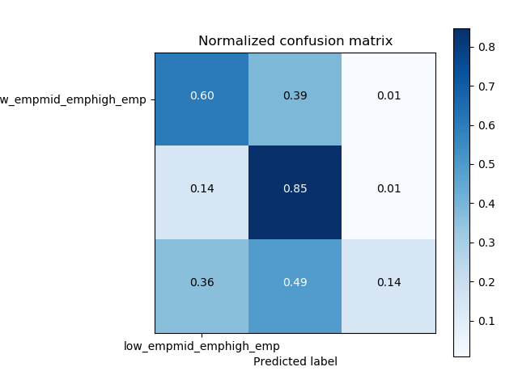

# Finetuned_network

Predicting employment labels using a finetuned Inceptionnet-V3 model.

Finetuning:

We take Keras InceptionNet-V3 model pretrained on Imagenet dataset and remove the last layer and add a fc layer with 1024
nodes. The last fc layer is trained for 2 epochs keeping weights of remaining layers fixed. 
All the layers in network are then trained for 2 epochs with small learning rate.

Model:

To train the network:

nohup python finetuned_inceptionnet.py >Results/finetune_log.txt 2>&1 &

Training loss:

Results:

Accuracy on test data = 67.58%

Unnormalized confusion matrix:

Normalized confusion matrix:

